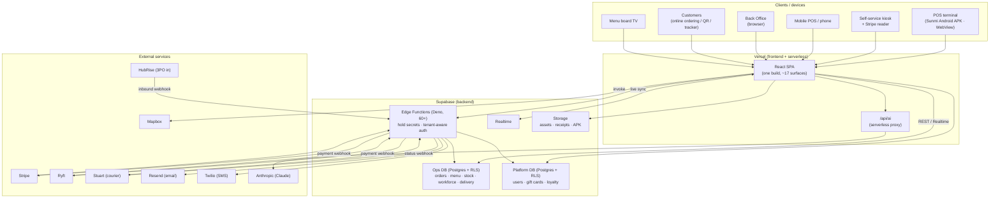
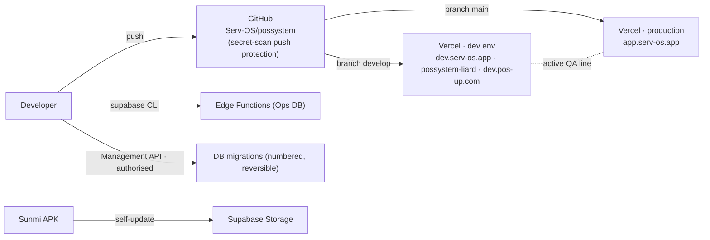
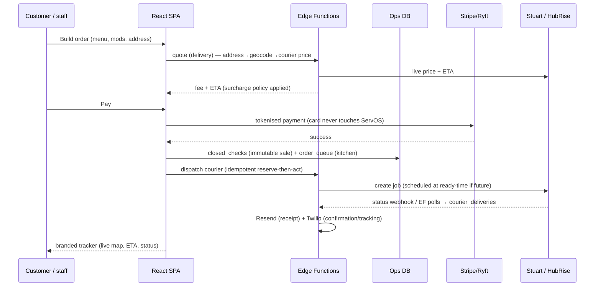
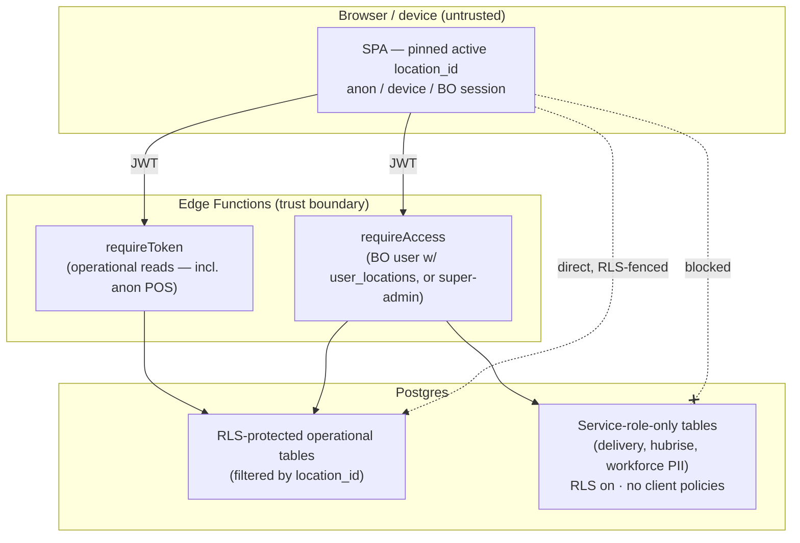
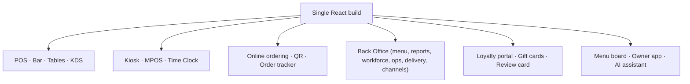

# ServOS — Topology & Architecture Diagrams

> System, deployment, data-flow and integration topology. Diagrams are [Mermaid](https://mermaid.js.org)
> (render natively on GitHub and in most IDEs). Last updated: 27 June 2026.

---

## 1. System context (who talks to what)



---

## 2. Deployment topology & promotion



*Edge-function deploys that write new columns run **after** the corresponding migration.*

---

## 3. Order → payment → fulfilment (request lifecycle)



---

## 4. Multi-tenancy & trust boundary



*Secrets (Stripe/Ryft/Twilio/Resend/Stuart/HubRise) and per-tenant courier credentials live behind
the edge tier and are never returned to the browser.*

---

## 5. Delivery fulfilment seam (own-courier vs aggregators)

```mermaid
flowchart LR
  ORDER["Delivery order"] --> MODE{delivery_mode}
  MODE -->|self| KITCHEN["Fires to POS/KDS<br/>venue delivers"]
  MODE -->|courier| BACKEND{dispatch_backend}
  BACKEND -->|stuart| STUART["Stuart — per-location account<br/>quote · schedule · dispatch · track"]
  BACKEND -.->|uber_api / hubrise_bridge<br/>(parked)| PARKED["Retired/parked seam"]
  INBOUND["Deliveroo / Uber Eats / Just Eat"] -->|HubRise webhook| HUB["Inbound 3PO orders<br/>→ Orders Hub + KDS"]
```

---

## 6. Surfaces from one codebase


